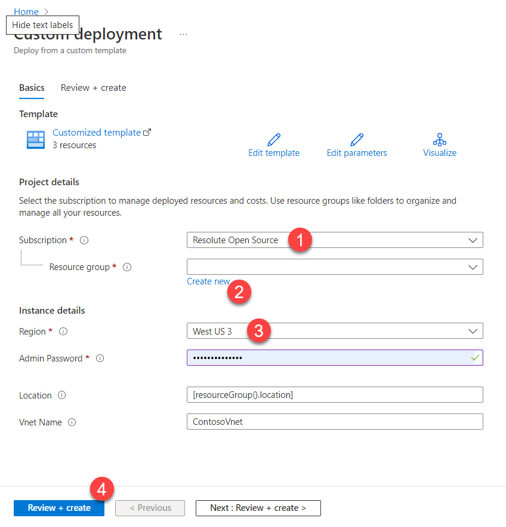

# Deploy RSNA demo infrastructure
This demo script deploys an AHDS DICOM service and a connected MedDream ZFP viewer.

## Prerequisites
- You need to create an App Registration and provide 4 variables.
- 

## Steps
  - Azure Portal
    -  click 
    - Fill in required information
      - Click *Review + create*
      - Click *Create*
      - .
  - ACI command line with Bicep
    - Clone this repo
    - Open a command line that has Azure CLI support and navigate to this folder (`./ahds_dicom_service_demos/demos/rsna)
    - Type the following commands:
      - `az login`
      - `az account set -s "<desired Azure Subscription Name>"  `
      - `az group create --location eastus --name yourUniqueResourceGroupName `
      - `az deployment group create --template-file .\deploy-rsna-demo-on-prem.bicep --resource-group yourUniqueResourceGroupName`
    - Enter a complex password that will be used later to log into the Jump-VM virtual machine that will be created
    - Wait until you have a successful deployment